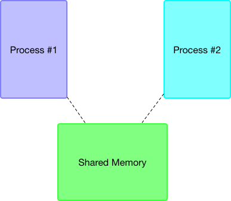

# Shared Memory

### `shmget()`

**Shared Memory** is a chunk of memory space that is purposefully allocated for processes to store
and use variables and data in a co-working environment. Each time we allocate a certain amount of memory space for sharing, we need to pass a numeric `key_t` variable as one of the argument to the `shmget()` system call, the role for `key_t` is act as a unique identifier for both processes (both forked and independent) to retreive the data from the shared memory, however if you wish to keep the allocated memory within your own program and its child process, you can specify `IPC_PRIVATE` to indicate such preference. 



Another argument to pass to `shmget` is the size of the memory you are going to allocate, and a bit flag that indicates the proper permission for process to access is set. Once the arguments have been accepted by the syscall, it returns an integer with a numeric id for your shared memory.

```
#include <stdio.h>
#include <stdlib.h>
#include <sys/ipc.h>
#include <sys/shm.h>
#include <sys/types.h>

#define SOMERANDOMNUMBER 1234
int main()
{
	int id;
	void* shm_addr;
	key_t key = SOMERANDOMNUMBER;
	...
	/* 
		Here we want this shared memory to be obtainable by other programmes, hence a key identifier is used.
	*/
	id = shmget(key, 4*sizeof(int), IPC_CREAT | 0666);
	if (id < 0)
	{
		perror("Error while calling shmget()");
		exit(1);
	}
	...
}
```

### `shmat()` & `shmdt()`

```void *shmat(int shmid, const void *shmaddr, int shmflg);```

Before we are going to use the shared memory, we must first attach the shared memory segment with the id returned by `shmget()` to the address space. This syscall function returns the address of the allocated space if it has successfully allocated the space, otherwise it returns an error number to indicate it has failed to allocated the space requested.

After we are done with the shared memory and would like to release them back to the Operating System, a `shmdt()` is here to serve the purpose of dettaching / disassociating the used memory space from the address that the process is holding.

```
{
	...

	shm_addr = shmat(id, NULL, 0);
	if(shm_addr == (char *) -1)
	{
		perror("Error occurred while attaching shared memory to address space");
		exit(1);
	}

	...

	// After are done with the allocated shared memory, detach it

	if (shmdt(shm_addr) == -1) perror("Error while dettaching shared memory address");
	
}
```


