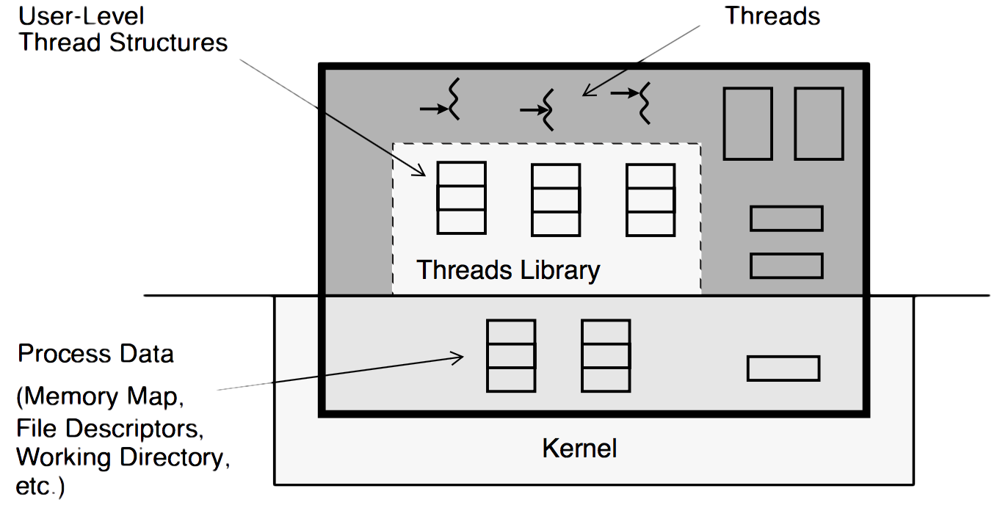

# Introduction to Multi-threaded Programming

A thread is a light-weight entity, comprising the registers, stack, and some other data. The rest of the process structure is shared by all threads: the address space, file descriptors, etc. Much (and sometimes all) of the thread structure is in user- space, allowing for very fast access.

All threads in a process share the state of that process. They reside in the exact same memory space, see the same functions, see the same data. When one thread alters a process variable (say, the working directory), all the others will see the change when they next access it. If one thread opens a file to read it, all the other threads can also read from it.

## The Value of Using Threads

A point to keep in mind here is that you are not replacing simple, non-threaded programs with fancy, complex, threaded ones. You are using threads only when you need them to replace complex or slow non-threaded programs. Threads are really just one more way you have to make your programming tasks easier.

The main benefits of writing multithreaded programs are:

* Performance gains from multiprocessing hardware (parallelism)

* Increased application throughput

* Increased application responsiveness

* Replacing process-to-process communications

* Efficient use of system resources

* Simplified realtime processing

* Simplified signal handling

* The ability to make use of the inherent concurrency of distributed objects

* There is one binary that runs well on both uniprocessors and multiprocessors

* The ability to create well-structured programs

* There can be a single source for multiple platforms